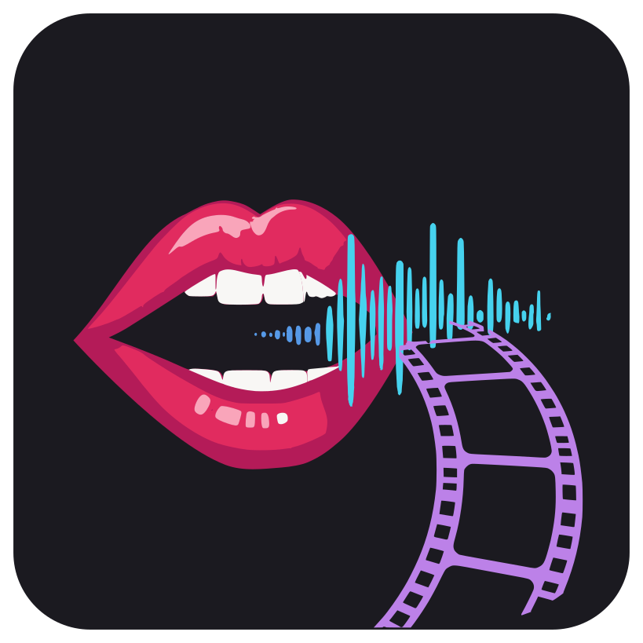
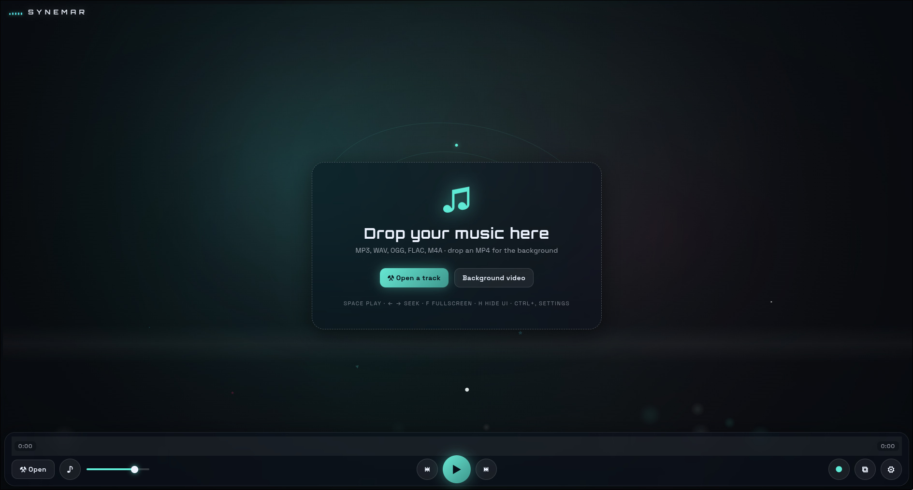

<p align="center">
  
</p>

<h1 align="center">🎧 Synemar</h1>

<p align="center">
  
  
  
  
</p>

<p align="center">
  <b>The beat-reactive music visualizer that turns any song into a fullscreen light show.</b><br />
  <i>Spectrum bars, waveforms and particle fireworks that dance to the kick drum — layered over
  crossfaded background videos and exported to YouTube-ready MP4 in one click. No account.
  No watermark. No uploads. 100% offline.</i>
</p>

<p align="center">
  <a href="#why-synemar">🔥 Why Synemar?</a> ·
  <a href="#features">✨ Features</a> ·
  <a href="#quick-start">⚡ Quick start</a> ·
  <a href="#recording">⏺ Recording</a> ·
  <a href="#faq">💬 FAQ</a> ·
  <a href="#license">📄 License</a>
</p>

## 📸 Screenshot
<div align="center">

</div>

## 🎬 See it in action
<a href="https://veedeo.org/videos/embed/msANP9DtgPNMz6rNQUwMCK">0xRavenBlack - Synemar (Music Video)</a>

---

## 🔥 Why Synemar?

Every other visualizer makes you pick between **pretty** and **practical**. Synemar is built for one
job: **making music videos that slap**. Open the playlist, add some tracks and MP4 loops, hit `R` —
and walk away with a finished, glitch-free MP4 synced frame-for-frame to your track.

- 🎨 **Fullscreen, beat-driven visuals** — not a screen-saver, an instrument you compose with.
- 🎞️ **Unlimited crossfaded background videos** — your loops, our silky ~0.9 s crossfade.
- 🎬 **Record visuals + audio to MP4 in one keypress** — no OBS, no screen capture, no watermark.
- ⌨️ **Keyboard-first** — play, pause, seek, mute, record, hide the UI without touching a mouse.
- 📐 **YouTube-shaped presets** — 1080p / 1440p / 4K, plus 1:1 and 9:16 for Shorts/Reels/TikTok.
- 🚀 **Boring-fast Electron app** — no bundler, no framework, no bloat, no account, no telemetry.
- 🆓 **MIT licensed** — free forever, even for commercial remixes.

## ✨ Features

- 🥁 **Beat-detection engine** — bass analysis spawns camera shake, ring bursts, particle pulses and
  aurora sweeps exactly on the kick. It *feels* the music.
- 🌌 **Particle systems** — hearts, stars, diamonds, triangles, squares, sparkles and rising dots,
  orbiting and swirling with the energy of the track.
- 🌊 **Full spectrum arsenal** — spectrum bars, breathing waveform, bass beams, vignette, scanlines
  and a sweeping aurora color layer.
- 📺 **Nostalgic retro filters** — CRT scanlines, film grain and VHS tracking wobble, each a
  one-click toggle for that worn-tape, old-monitor look.
- 🎞️ **Combined audio + video playlist** — one overlay (audio left, video right) for unlimited
  tracks. Audio auto-plays one after another; muted MP4s crossfade on their own independent loop.
  Playlists persist by file path and export/import as JSON.
- 🏷️ **Smart track metadata** — ID3v1/v2 + FLAC tags (or an `Artist - Title` filename fallback)
  fill in title, artist and album automatically.
- 🎨 **Deep customization** — text/accent/spectrum colors, hue shifting, bar count, smoothing,
  dimming, blur and per-effect toggles, plus the retro CRT/grain/VHS filters.
- ⏺ **One-click MP4 recording** — h264 + aac, exact composite of video + colors + visuals + audio,
  buffered and muxed in a single offline encode for perfect A/V sync.
- 🙈 **Clean-screen mode** — press `H` for a distraction-free backdrop for live shows or clips.
- ✨ Plus: drag & drop for audio *and* video, freestanding draggable title, window-size presets,
  restore-without-autoplay, and a fully hidden UI that stays one keystroke away.

## 🖥️ Requirements

- 🟢 Node.js 20+ and npm
- 🎥 [ffmpeg](https://ffmpeg.org) on the `PATH` (only needed for recording)
- 🐧🪟🍎 Linux, macOS or Windows

## ⚡ Quick start

```bash
npm install
npm start
```

Then open the **Playlist** (`Ctrl+P`, the `☰ Playlist` dock button, or the "Open the playlist"
button on the startup screen) and add your files — or just **drag & drop** MP3/WAV/OGG/FLAC/M4A
and MP4s anywhere onto the window. 🎞️

## 🎮 Controls

| 🎹 Key             | Action                          |
| ------------------ | ------------------------------- |
| `Space`            | Play / pause                    |
| `←` / `→`          | Seek −/+ 10 s (`Shift`: 60 s)   |
| `M`                | Mute                            |
| `F` / `F11`        | Toggle fullscreen               |
| `R`                | Start / stop recording          |
| `H`                | Hide/show UI                    |
| `Ctrl+,` / `Cmd+,` | Settings                        |
| `Ctrl+P` / `Cmd+P`, `L` | Toggle the playlist        |
| `Ctrl+O` / `Cmd+O` | Open track                      |
| 🖱️ Double-click    | Toggle fullscreen               |

## 🎞️ Music and video playlists

Open the **Playlist** overlay (`Ctrl+P`, `L`, the `☰ Playlist` dock button, or the startup screen's
"Open the playlist" button):

- **Audio** (left) — add unlimited tracks; they play one after another, auto-advancing endlessly.
- **Video** (right) — add unlimited MP4s; they crossfade (~0.9 s) on their own independent loop.
- Drag to reorder rows, click a row to jump to it, ✕ to remove, and **Clear** to empty a list.
- Drag & drop files onto either column to append; drop them on the window to add anywhere.
- **Export JSON / Import JSON** saves or restores the whole playlist (name + both lists) through a
  file dialog.

The playlist persists automatically by file path and is restored on launch — music and videos stay
independently in sync.

## ⏺ Recording

Press `R` (or the **●** button in the dock) to start, `R` again to stop. Out comes
`synemar-rec-<timestamp>.mp4` (h264 + aac) in your videos folder (falling back to Downloads/home).

The recording reproduces exactly what you see on screen — background video, dimming, vignette,
colors and the visualization itself — plus the audio of the track. Frames are buffered to a temp
file and audio is tapped straight from the Web Audio graph; on stop, everything is muxed in **one
offline encode pass**, so the output is exact and glitch-free — not a real-time screen grab.

Pipeline secrets for the curious: `media://` range-request streaming for videos, a hand-rolled ID3
parser, and a deterministic composite copied frame-by-frame into the final render. It is engineered
for *precise* audio/video length — no drift, no stutter, no deadlocks.

## ⚙️ Settings

- 🎞️ **Background** — fallback color, dimming, blur (videos are managed in the playlist overlay).
- 🎨 **Colors** — text, accent, viz top/bottom.
- 🧮 **Visualizer** — bars, smoothing, hue shifting, particle energy, beat shake, aurora, particles,
  plus the retro CRT scanlines, film grain and VHS wobble filters.
- 👁️ **Interface** — logo, player controls, title position.
- 📐 **Recording canvas** — 1080p / 1440p / 4K / 1:1 / 9:16 presets.

**Reset to defaults** restores everything; your playlist is untouched. Every setting is persisted
locally — nothing ever leaves your machine.

## 🧱 Under the hood

- ⚛️ **Electron** (main + preload + renderer)
- 🎛️ **Web Audio API** — decode, analyser nodes, beat detection
- 🖌️ **Canvas 2D** — all drawing, DPI-aware, GPU-friendly
- 🔌 **Custom `media://` protocol** — range-request video streaming for seamless backgrounds
- 🏷️ **Hand-rolled ID3v1/v2 tag parser** — zero heavy tag dependencies
- 🧪 **Node-testable modules** — 8 offline unit-test suites keep the core honest

No bundler. No framework. Plain JavaScript and HTML/CSS — readable, hackable, yours. ✌️

## 🛠️ Development

```bash
npm test              # run all 8 offline unit suites
npm run syntax-check  # node --check every JS file
npm run dist          # installers for the current OS (AppImage + deb on Linux)
npm run dist:dir      # fast unpacked build for smoke tests
```

## 💬 FAQ

**Is Synemar really free?** Yes — MIT licensed, free forever, including for commercial videos.

**Does it upload my music or recordings?** Never. Everything runs 100% offline; there is no account,
no telemetry and no cloud component.

**Can I use it for YouTube / TikTok / Instagram Reels?** That's the point. Use the window presets to
frame 16:9, 1:1 or 9:16, then hit `R` for a finished MP4 ready to upload.

**What audio formats are supported?** MP3, WAV, OGG, FLAC and M4A, via drag & drop or the file
picker.

**Can I put my own videos behind the visuals?** Yes — up to 5 MP4s, looped/sequenced with a soft
crossfade, with dimming and blur so the visuals stay the star.

**Does recording match what I see on screen?** Frame-for-frame. The composite is rebuilt deterministically
and encoded in a single offline ffmpeg pass for exact A/V alignment.

**Is ffmpeg required to just play music?** No — only for recording. Without it, Synemar plays and
visualizes fine.

**What about a Windows / macOS installer?** `npm run dist` produces native installers for your OS;
Linux additionally ships a deb, an AppImage and an Arch `PKGBUILD`.

## 🔎 Related searches

`music visualizer` · `audio visualizer` · `mp3 visualizer` · `beat-reactive video` · `spectrum visualizer`
· `waveform visualizer` · `free music visualizer open source` · `electron music visualizer` ·
`visualizer for YouTube` · `background video player with crossfade` · `record music visualizer mp4`

## 📄 License

[MIT](LICENSE) — free to use, remix and rock out to. 🎸

<!-- seo: music visualizer, audio visualizer, mp3 visualizer, beat-reactive visualizer, free music visualizer open source, electron music visualizer, spectrum analyzer, waveform visualizer, fullscreen light show, record visualizer to mp4, youtube music video maker, background video crossfade, visualizer for tiktok reels shorts, id3 tag reader, beat detection bass -->